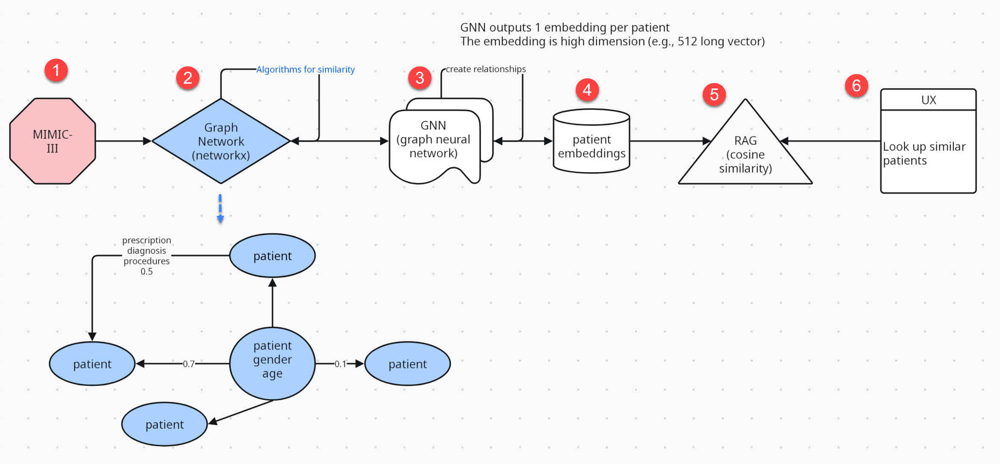

# ut-health-final-proj
Final high risk project for AI in Healthcare 

# Create the environment
Install conda from the anaconda website at [www.anaconda.org/download](https://www.anaconda.com/download)

After installing Anaconda, open a command prompt and execute:
`conda env create -f environment.yml`

These are the important packages used:

* __SQLAlchemy__ for loading MIMIC-III data
* __networkx__ for creating the network graph 
* __pyvis__ for visualizing and debugging the network graph

# Project Architecture

# Important Files

## 01-create-network-graph.ipynb
This file assumes you have SQL Lite installed and MIMIC-III data loaded into it.

The output of this file is in the folder `pickle`. It outputs files in the format `patients_graph_max_X_nodes.gpickle`
The `X` in the file name specifies the number of patients nodes, hence, the size of the graph.

E.g., 
* `patients_graph_max_10_nodes.gpickle` means the pickle file has 10 patient nodes and is a relatively small and manageable file to process on a laptop.
* `patients_graph_max_40000_nodes.gpickle` means the pickle file has 40,000 patient nodes and is a very large file that cannot be loaded on your laptop.

Pick a file accordingly.

