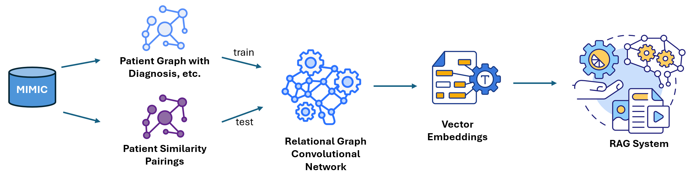
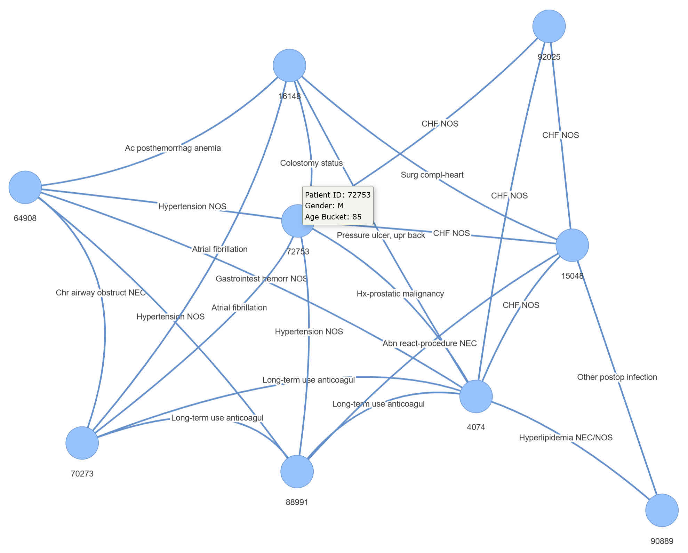

# ut-health-final-proj
Final high risk project for AI in Healthcare 

# Create the environment
Install conda from the anaconda website at [www.anaconda.org/download](https://www.anaconda.com/download)

After installing Anaconda, open a command prompt and:
* go to the directory where this repo has been downloaded
* execute `conda env create -f environment.yml`

These are the important packages used:

* __SQLAlchemy__ for loading MIMIC-III data
* __networkx__ for creating the network graph 
* __pyvis__ for visualizing and debugging the network graph

# Project Architecture

# Graph Network Structure

The graph is created in the jupyter file `01-create-network-graph.ipynb`.
This file assumes you have SQL Lite installed and MIMIC-III data loaded into it.

The `networkx` library is used to create the graph. The graph has 3 nodes:
1. Patient
2. Diagnosis
3. Procedures

The graph is connected via edges:
* `patient`--`has_diagnosis`-->`diagnosis`
* `patient`--`had_procedure`-->`procedure`

# Network Graph
We use a heterogenous graph called `R-GCN` as it can handle different types of graph nodes as described in the section in [Graph Network Structure](#graph-network-structure).

## Model
The graph created converted to data represented by `torch_geometric.data.HeteroData` in the `torch geometric` library.

The R-GCN model is created using the `RGCNConv` layers.

## Input Data

The `networkx` graph is transformed into the `torch_geometric.data.HeteroData` data type.
`HeteroData` has 3 types of information:
1. Node data
2. Edge data
3. Edge type data

### Node Data
This is filled into `HeteroData.x`.

`x` data shape:  `[number of nodes, number of node features]`, number of nodes is the total number of nodes in the graph

#### User friendly structure
The data can be created using:
* `HeteroData[patient_id].x` = `[num_patients, num_patient_features]`
* `HeteroData[diagnosis_id].x` = `[num_diagnoses, num_diagnosis_features]`
* `HeteroData[procedures].x` = `[num_procedures, num_procedure_features]`

#### Internal structure
The data within `HeteroData` nodes is represented as a single matrix.

Example of internal __Node__ data:
  * there are 1 patient nodes with 2 features, 2 diagnosis nodes, 1 procedure nodes with 1 feature
  * Data shape will be `[1+2+1, 2+0+1]` which is `[4, 3]`.

The __node__ data matrix will look like:

     |1    5   NaN|
     |0    6   NaN|
     |NaN NaN  NaN|
     |NaN NaN  NaN|
     |NaN NaN   7 |

The matrix above is one-hot encoded. Each row represents one node:
* 1st and 2nd rows are patient nodes with two features (e.g., gender and age_bucket)
* 3rd and 4th rows are diagnosis nodes with no features
* 5th row is procedure node with one feature (e.g., icd9 code)

Note that each row is an index into a node.

### Edge Data
This is filled into `HeteroData.edge_index`.

`edge_index` data shape: `[2, total number of edges]`
  * First row at index `0`: indices of all source nodes
  * Second row at index `1`: indices of all target nodes 

Example, if there are 5 edges, then the matrix will be `[2, 5]` and look like:

      |0 1 0 0 0|
      |2 3 0 0 0|

The __edge__ matrix shows that the:
* first patient node is connected to the third diagnosis node.
* second patient node is connected to the fourth diagnosis node. 

The indices in the __edge__ matrix above refer to the node matrix rows.

### Edge Type Data

This is the simplest. It is a 1D vector that has the same number of rows as the __edage_ data matrix.
Each entry represents the type of edge that exists in the __edge__ matrix. Hence the shape is `[total number of edges]`

Our graph has 2 types of edges:
1. `Patient`--`has_diagnosis`-->`Diagnosis` represented by `0`
2. `Patient`--`had_procedure`-->`Procedure` represented by `1`

Edge type data is very useful for R-GCN networks.

## Validation Data

## Output Data

# Inference

# Pickle files of network graph
The graph is saved as a pickle file in the directory [pickle](pickle/)

Each pickle file is named according to the number of nodes it contains.

The pickle file has the graph where:
* each node is a patient
* each edge is a diagnosis connecting two patients

There are two types of pickle files:
* __pickle file__: this is in the [pickle](pickle/) folder which contains the serialized network graphs in binary form. It has 2 types of files:
  * patient graph pickle file (all patients, diagnosis and procedures connected via patients)
  * patient graph similarity pickle file (patients similar to other patients)
  * patient graph dissimilarity pickle file (patients dissimilar to other patients)

The pickle files are named in the format `patients_graph_max_XX_nodes.gpickle`. The `XX` in the file name specifies the number of patients nodes, hence, the size of the graph.
Files that contain data for similarity have the word `similarity` appended in them. E.g., `patients_graph_max_XX_nodes_similarity.gpickle`

E.g.:, 
* `patients_graph_max_10_nodes.gpickle` means the pickle file has 10 patient nodes and is a relatively small and manageable file to process on a laptop.
* `patients_graph_max_40000_nodes.gpickle` means the pickle file has 40,000 patient nodes and is a very large file that cannot be loaded on your laptop.

Pick a pickle file accordingly.

The pyvis files in the [pyvis](pyvis/) folder are named in the same manner.

# Visual graph
The visual graph is saved as an HTML file in the directory [pyvis](pyvis/). This graph is created with the library `pyvis` and represents the underlying network graph (created with library `networkx`) that it visually represents.

__pyvis file__: these files contain the html representations of the network graph with patient, diagnosis and procedure nodes

The pyvis graph is useful for:
* visually observing the network graph
* exploring the nodes and edges
* validating the structure of the `networkx` graph that this pyvis graph represents

Sample Pyvis graph with 9 patient nodes connected by shared diagnoses:

Sample Pyvis similarity graph with 5 patients. Each edge has a similarity score connecting two patients:

